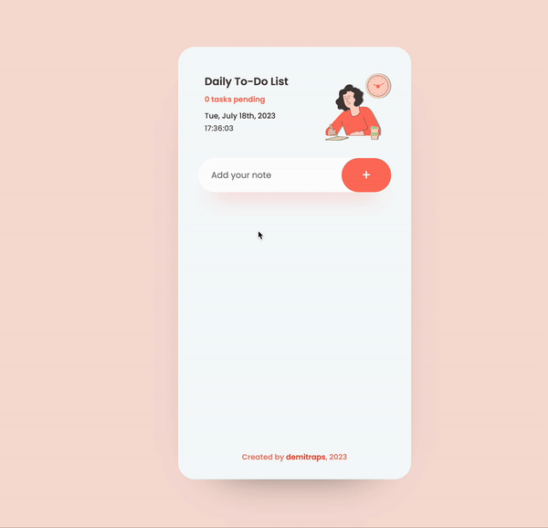

# Daily To-Do List App

A simple daily to-do list app, created with Vanilla JavaScript, to help you organize and manage your tasks effectively. It provides a user-friendly interface where you can easily add, complete, and delete tasks. The app displays the current date and time, allowing you to stay on top of your schedule. 

## Screenshot

---

## Demo

## Run
https://majestic-smakager-f1806a.netlify.app/